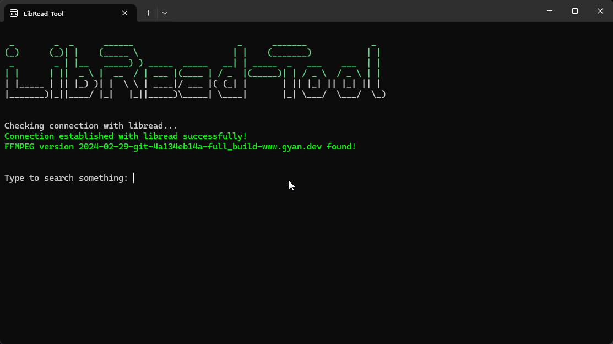

<h1>LibRead-Tool</h1>
<strong><i>Converts online novels into audiobooks</i></strong>
 
 

  
Introducing LibRead-tool – your go-to for turning online novels into awesome audio! Fetch your favourites and convert them into audiobooks. Say hello to hands-free storytelling!

## 🌸 Features
- 🔍 **Search** novels directly within LibRead-Tool
- 📕 Convert novels into one audiobook or **Split it into parts** 
-  💾 Embeds **ID3 tags** into the MP3 file
- 🌐 **Scrapes LibRead** to fetch novels

## 🔧Installation
#### Using Portable Builds
- This is the recommended method if Python is not installed on your system.
- Download the executable binary files from the release page for your system
- To execute the program, use the following method
	- On Windows, double-click on the application to run it.
	- On Ubuntu-based distros, open a terminal in the directory where the executable file is saved and execute the following command `./LibRead-Tool_Zorin-OS`.   If you are getting a permission denied error, then you have to execute the command  `chmod +x LibRead-Tool_Zorin-OS` to make it executable.

 

<h4 id="running-from-source">Running from source</h4>
<ul>
<li>You need Python, preferably version &gt;= 3.9, to run the script files.</li>
<li>You can obtain the source code files either from the release page or by cloning this repo using git,</li>
<li>Downloading pip to resolve dependecies<ul>
<li>Pip is required to download the packages required for the execution of the script. If your system doesn’t have pip installed, then you can use the following command to install<ul>
<li>On Debian/Ubuntu-Based Distros
  <code>sudo apt-get install python3-pip</code> </li>
<li>On Red Hat/Fedora-Based Distros
  <code>sudo dnf install python3-pip</code></li>
</ul>
</li>
</ul>
</li>
<li>Resolving dependencies using pip<ul>
<li>Open a terminal in the <strong><em>src</em></strong> directory and execute the following command to obtain the packages required for the script.
 <code>pip install -r requirements.txt</code></li>
</ul>
</li>
<li>Executing the script<ul>
<li>To run the script, execute the following command in the terminal.
  <code>python3 ./libread-tool.py</code>
 </li>
</ul>
</li>
</ul>
 
<h4 id="installing-optional-dependency">Installing Optional Dependency</h4>
<ul>
<li><a href="https://ffmpeg.org/">FFmpeg</a> is required to merge different sub-parts into one. It is not essential to have it installed, but it increases stability during conversions. If FFmpeg is not found in the system’s path, then it will fetch all the chapters in a single part and convert them at the end.</li>
<li>Use <a href="https://phoenixnap.com/kb/ffmpeg-windows">this</a> guide to get it installed on your windows OS.</li>
<li>Most Linux distros come pre-installed with a supported version of FFmpeg. But, if that&#39;s not the case, then use the following command to get it installed.<ul>
<li>On Debian/Ubuntu-based distros
 <code>sudo apt install ffmpeg</code></li>
<li>On Fedora-based distros
  <code>sudo dnf  install  ffmpeg</code></li>
</ul>
</li>
</ul>
 
<h2 id="-configuring">⚙️ Configuring</h2>

Upon initial execution, the program will create a default configuration file inside the same directory named <strong>libread-config.ini</strong>. You can open that in any text editor, and you might change some options.

 
 

 <i>Packages Used</i>

 
<a href="https://pypi.org/project/beautifulsoup4/">beautifulsoup4</a>
 
<a href="https://pypi.org/project/requests/">requests</a>
 
<a href="https://pypi.org/project/music-tag/">music-tag</a>
 
<a href="https://pypi.org/project/pynput/">pynput</a> 
 
<a href="https://pypi.org/project/PyWinCtl/">PyWinCtl</a>
 
<a href="https://pypi.org/project/edge-tts/">edge-tts</a>

